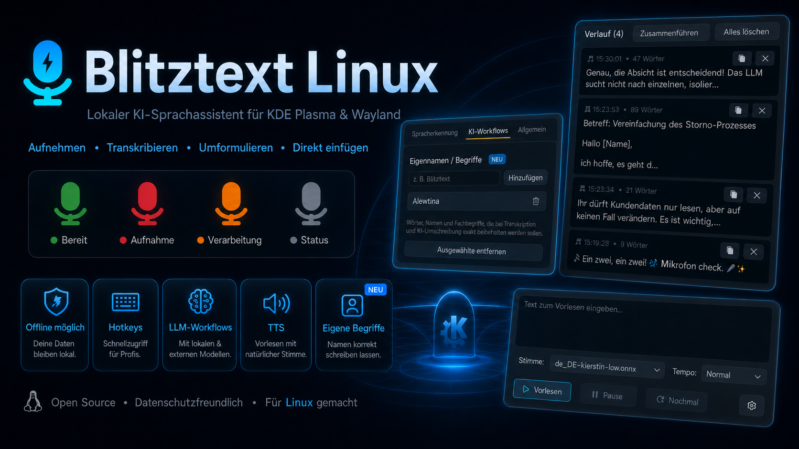
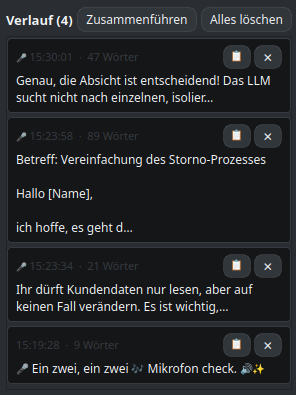
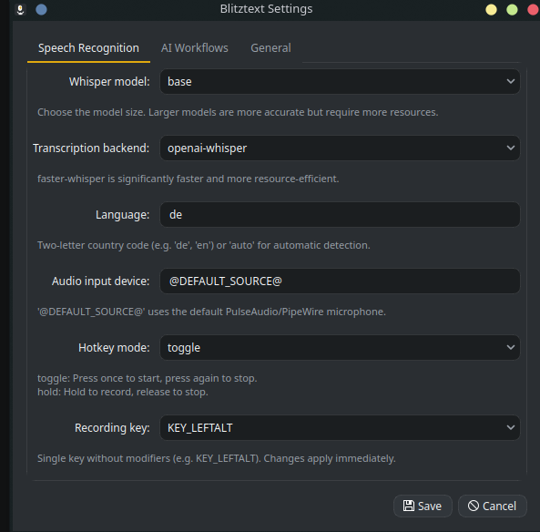
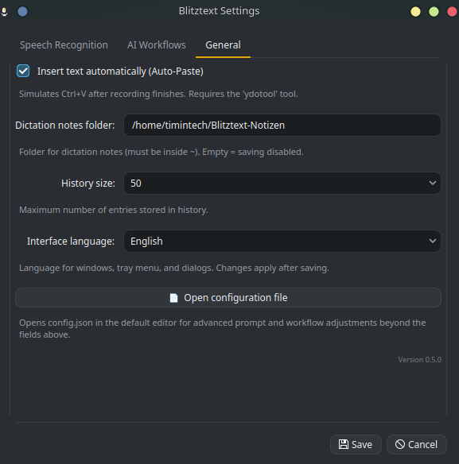

<div align="center">
  

  <h1>Blitztext Linux</h1>
  <p><strong>Dein lokaler KI-Sprachassistent für KDE Plasma & Wayland</strong></p>

  <p>
    <a href="https://github.com/TimInTech/blitztext-linux/actions/workflows/blitztext-linux-ci.yml"></a>
    <a href="LICENSE"></a>
    
  </p>
  <p><a href="README.md">🇬🇧 English</a> | <strong>🇩🇪 Deutsch</strong></p>
  <p><i>Sprache per Hotkey aufnehmen, lokal oder online transkribieren, optional per LLM umschreiben und direkt in die aktive Anwendung einfügen.</i></p>
</div>

> [!IMPORTANT]
> **Eigenständiger Linux-Port:** Dieses Repository enthält ausschließlich den Linux-Port von Blitztext – eine eigenständige Python 3/PyQt6-Implementierung optimiert für **Kubuntu/Ubuntu unter KDE Plasma mit Wayland**. Für die originale macOS-Version besuche bitte das [offizielle Haupt-Repository](https://github.com/cmagnussen/blitztext-app).

---

## Features

- **Mehrsprachige Oberfläche (EN/DE):** Schalte die App-Oberfläche zwischen Deutsch und Englisch um – unter **Einstellungen → Allgemein → „Sprache der Oberfläche"** (die Änderung greift nach einem Neustart der App).
- **Compose-Fenster:** Text eintippen oder einfügen, einen Workflow und Schreibstil wählen und von der KI umschreiben lassen — ganz ohne Mikrofon. Mit Tonfall-Auswahl, eigenem Preset, Varianten-Verlauf und Signatur-Unterstützung.
- **OpenRouter & eigene LLM-Endpunkte:** Nutze OpenRouter oder eine beliebige OpenAI-kompatible API als Alternative zu OpenAI für alle KI-Workflows.
- **Audio-Export:** Speichere die Ausgabe der Vorlesefunktion direkt als Audiodatei.
- **Eigennamen / Begriffe:** Erweitere das Vokabular der KI um eigene Begriffe, Namen oder Fachwörter für perfekte Transkriptionen.
- **Globale Hotkeys:** Jederzeit von überall im System aufnehmen.
- **Auto-Paste:** Erkennt Sprache und fügt sie direkt dort ein, wo der Cursor ist.
- **LLM-gestützte Workflows:** Lass die KI deine Sätze professionell umformulieren, emotional filtern oder mit passenden Emojis anreichern.
- **Lokale Verarbeitung:** Optional 100% offline für volle Privatsphäre.

---

## Installation

### Schnellinstallation (empfohlen)

Der einfachste Weg, um Blitztext auf deinem System bereitzustellen:

```bash
git clone https://github.com/TimInTech/blitztext-linux.git
cd blitztext-linux
bash scripts/install.sh
```

**Was macht das Skript?**
Es ist idempotent (mehrfach ausführbar) und erledigt alles vollautomatisch:
1. Prüft dein System (Ubuntu/Debian) & Python-Version.
2. Installiert fehlende Systempakete (inkl. `pipx`).
3. Richtet eine `.venv` Umgebung ein und installiert `openai-whisper`/`faster-whisper`.
4. Bereitet `ydotool.service` und den systemd-User-Service vor.

### Nach der Installation

1. **Neustart erforderlich** (oder ab-/anmelden), damit die Gruppe `input` aktiv wird. Danach checken:
   ```bash
   bash scripts/verify.sh
   ```
2. **Manuell testen:**
   ```bash
   ./run.sh
   ```
   *(Erscheint das Tray-Symbol und reagieren die Hotkeys? Dann lief alles glatt!)*
3. **Autostart aktivieren:**
   ```bash
   systemctl --user start blitztext-linux
   ```

<details>
<summary><b>Autostart wieder deaktivieren</b></summary>

```bash
systemctl --user stop blitztext-linux
systemctl --user disable blitztext-linux
```
</details>

<details>
<summary><b>Manuelle Installation (Diagnose / Experten)</b></summary>

Falls du gezielt debuggen möchtest, anstatt `scripts/install.sh` zu nutzen:

**1. Systempakete (apt)**
```bash
sudo apt install pulseaudio-utils wl-clipboard xclip ydotool ffmpeg python3-venv python3-evdev build-essential python3-dev socat pipx
```

| Paket | Zweck |
| :--- | :--- |
| `pulseaudio-utils` | `parec` für die Audioaufnahme via PulseAudio/PipeWire |
| `wl-clipboard` / `xclip` | Zwischenablage unter Wayland (`wl-copy`) bzw. X11-Fallback |
| `ydotool` (≥ 1.0) | Simuliert `Ctrl+V` für automatisches Einfügen (Auto-Paste). Ab Version 1.0 werden rohe Keycodes verwendet. **Ubuntu 25.10/26.04** liefern ydotool ≥ 1.0 (1.0.4) direkt via `apt`. **Ubuntu 24.04 und 22.04** liefern per `apt` nur 0.1.x (z. B. 0.1.8), das keine Keycodes unterstützt und damit kein Auto-Paste – dort ydotool ≥ 1.0 aus dem Quellcode bauen (siehe unten). Auto-Paste auf 24.04, 25.10 und 26.04 verifiziert. |
| `ffmpeg` | Audio-Konvertierungen |
| `python3-evdev` | Eingabegeräte-Zugriff für den systemweiten Hotkey-Daemon |
| `socat` | Optionale Socket-Kommunikation |
| `pipx` | Isolierte Installation von Whisper-Engines |

**2. evdev-Rechte vergeben**
```bash
sudo usermod -aG input $USER
```

**3. Virtuelle Umgebung & Python-Pakete**
```bash
python3 -m venv .venv
source .venv/bin/activate
pip install PyQt6 evdev openai pytest openai-whisper faster-whisper
```

**4. Whisper-Engine als Alternative via pipx**
Falls Sie `openai-whisper` losgelöst von der venv installieren möchten (umgeht Versionskonflikte auf neueren Ubuntu-Setups durch Python 3.11):
```bash
pipx install --python "$(command -v python3.11)" openai-whisper
pipx inject openai-whisper faster-whisper   # optional, für beschleunigte Ausführung
```

**5. ydotool prüfen**
```bash
systemctl --user start ydotool.service
```
Liefert `apt` nur ydotool 0.1.x (Ubuntu 24.04/22.04), ydotool ≥ 1.0 aus dem Quellcode bauen:
```bash
sudo apt install cmake build-essential scdoc git
git clone --depth 1 --branch v1.0.4 https://github.com/ReimuNotMoe/ydotool.git
cd ydotool && cmake -B build -DCMAKE_BUILD_TYPE=Release && make -C build && sudo make -C build install
systemctl --user enable --now ydotool.service   # nutzt /usr/local/bin/ydotoold
```

**6. Anwendung starten**
```bash
./run.sh
```
</details>

---

## Die 5 Workflows und Hotkeys

Blitztext registriert globale Hotkeys via `evdev`. Mit diesen Kombinationen hast du die volle Kontrolle:

| Workflow | Hotkey | LLM? | Beschreibung |
| :--- | :--- | :---: | :--- |
| **Blitztext** | <kbd>Meta</kbd> + <kbd>H</kbd> | ❌ | Standard: Nimmt auf, transkribiert und fügt den Text ein. |
| **Blitztext Lokal** | <kbd>Meta</kbd> + <kbd>Shift</kbd> + <kbd>H</kbd> | ❌ | Erzwingt eine reine **Offline-Transkription**. |
| **Blitztext+** | <kbd>Meta</kbd> + <kbd>Shift</kbd> + <kbd>T</kbd> | ✅ | Formuliert deine Aufnahme professionell via LLM um. |
| **Blitztext $%&!** | <kbd>Meta</kbd> + <kbd>Shift</kbd> + <kbd>D</kbd> | ✅ | Emotionale Entladung: Wandelt Frust in eine sachliche Nachricht um. |
| **Blitztext :)** | <kbd>Meta</kbd> + <kbd>Shift</kbd> + <kbd>E</kbd> | ✅ | Ergänzt deine Nachricht passend mit Emojis. |

> [!NOTE]
> **LLM-Workflows** (`Blitztext+`, `Blitztext $%&!`, `Blitztext :)`) setzen einen gültigen **API-Key** voraus. Lege ihn am einfachsten in `~/.config/blitztext-linux/secrets.env` ab, indem du dort die Variable mit deinem Key als Wert setzt (Zeilenformat `NAME=WERT`, z. B. `OPENAI_API_KEY=sk-…`). `./run.sh` und der systemd-Service laden diese Datei automatisch. Ohne diesen Key sind diese Funktionen im Menü und über die Hotkeys deaktiviert bzw. führen zu einer Fehlermeldung.

## KI-Workflows

Die KI-Workflows helfen bei Formulierung, Ton und Emojis. Die passenden Einstellungen findest du unter **Einstellungen → KI-Workflows**:

<div align="center">
  
  <br><br>
</div>

### LLM-Anbieter

Blitztext unterstützt drei Anbieter-Modi, wählbar unter **Einstellungen → KI-Workflows → „LLM-Anbieter"**:

| Anbieter | Wann verwenden |
| :--- | :--- |
| **OpenAI** (Standard) | Standard-OpenAI-API mit `gpt-4o-mini` oder einem anderen Modell. |
| **OpenRouter** | Zugriff auf hunderte Modelle über einen einzigen API-Key (`OPENROUTER_API_KEY`). Base-URL: `https://openrouter.ai/api/v1`. |
| **Eigener Endpunkt** | Jede OpenAI-kompatible API — „Base-URL" und „LLM-Modell" auf den Anbieter anpassen. |

Für OpenRouter `base_url` auf `https://openrouter.ai/api/v1` setzen und Modell wählen (z. B. `openai/gpt-4o`). Der Name der API-Key-Umgebungsvariable wird unter „API-Key-Umgebung" eingestellt.

### Schreibstil-Vorlagen

Für den Workflow **Blitztext+** (Text-Verbesserer) gibt es vorgefertigte Schreibstil-Vorlagen, die du unter **Einstellungen → KI-Workflows → „Schreibstil-Vorlage"** oder direkt im **Compose-Fenster** auswählst:

| Vorlage | Wirkung |
| --- | --- |
| **Standard (Text verbessern)** | Bisheriges Verhalten – sauber formatierter Text, der gewählte **Tonfall** greift. |
| **E-Mail – formell** | Höfliche E-Mail in der Sie-Form mit klarer Struktur. |
| **E-Mail – locker** | Freundliche E-Mail in der Du-Form. |
| **Stichpunkte** | Gliedert den Inhalt in prägnante Stichpunkte. |
| **Zusammenfassung** | Knappe, sachliche Zusammenfassung der Kernaussagen. |
| **Persönlich (Du-Form)** | Klarer Text in der persönlichen Du-Form. |
| **Höflich (Sie-Form)** | Klarer Text in der höflichen Sie-Form. |
| **Kurz & präzise** | Maximal knapp, ohne Füllwörter und Wiederholungen. |
| **Eigenes Preset…** | Ein freier System-Prompt, den du selbst unter **Einstellungen → Allgemein → „Eigenes Preset (Compose)"** festlegst. |

> Bei **Standard** wird zusätzlich der eingestellte **Tonfall** angewendet. Jede andere Vorlage bringt ihren eigenen Schreibstil mit und überschreibt den Tonfall. Eigennamen/Begriffe bleiben in allen Vorlagen erhalten.

---

## Compose-Fenster

Das **Compose-Fenster** (`✍ Compose…` im Tray-Kontextmenü) ermöglicht das Umschreiben beliebiger Texte mit der KI — ganz ohne Sprachaufnahme. Es eignet sich ideal zum Überarbeiten fertiger Entwürfe, E-Mails oder Notizen.

**Öffnen:** Klick auf das Tray-Icon → **✍ Compose…**

**Was du im Compose-Fenster tun kannst:**

| Element | Beschreibung |
| :--- | :--- |
| **Entwurf (linkes Feld)** | Text eintippen oder einfügen, der umgeschrieben werden soll. |
| **Workflow** | Wähle zwischen Blitztext+ (Text-Verbesserer), Blitztext $%&! (Dampfablassen) oder Blitztext :) (Emojis). |
| **Schreibstil-Vorlage** | Vorlage auswählen oder **Eigenes Preset…** für einen vollständig freien System-Prompt. |
| **Tonfall** | Locker, neutral oder professionell. Aktiv nur bei **Standard**-Preset + **Blitztext+**; bei allen anderen Vorlagen ausgegraut (Tooltip erklärt warum). |
| **Verbessern** | Sendet den Entwurf an die KI und zeigt das Ergebnis im rechten Feld. |
| **Varianten-Verlauf** | Die letzten 10 generierten Ergebnisse der aktuellen Sitzung werden als scrollbare Liste gespeichert — Klick auf einen Eintrag stellt ihn wieder her. |
| **Signatur** | Hängt deine gespeicherte Signatur an (konfiguriert unter **Einstellungen → Allgemein**). Ersetzt automatisch gängige KI-generierte Platzhalter wie `[Your Name]`, `[Ihr Name]`, `[Vorname Nachname]`, `[Signature]` u. Ä. — kein verlorener Platzhalter bleibt zurück. |
| **Kopieren** | Kopiert das Ergebnis in die Zwischenablage. |
| **Einfügen & Schließen** | Fügt das Ergebnis direkt in die aktive Anwendung ein und schließt das Fenster. |

> [!NOTE]
> Signatur und eigener Preset-Text werden unter **Einstellungen → Allgemein** konfiguriert. Setze dort „Signatur für das Compose-Fenster" und aktiviere „Nach jeder Generierung automatisch anhängen", wenn die Signatur bei jedem Ergebnis ergänzt werden soll.

---

## Tray-Symbol: Statusfarben

Das Mikrofon im System-Tray ist dein Indikator für den aktuellen Zustand:

<div align="center">
  <table>
    <tr>
      <td align="center" width="25%">
        <br><br>
        <b>Grün</b> (IDLE)<br>
        <i>Bereit — wartet auf deinen Einsatz.</i>
      </td>
      <td align="center" width="25%">
        <br><br>
        <b>Rot</b> (RECORDING)<br>
        <i>Aufnahme läuft aktiv.</i>
      </td>
      <td align="center" width="25%">
        <br><br>
        <b>Orange</b> (TRANSCRIBING)<br>
        <i>Magie läuft (Transkription / KI-Umformulierung).</i>
      </td>
      <td align="center" width="25%">
        <br><br>
        <b>Grau</b> (ERROR)<br>
        <i>Ups, etwas ist schiefgelaufen.</i>
      </td>
    </tr>
  </table>
</div>

Das Tray-Kontextmenü gibt dir schnellen Zugriff auf alle Workflows, das Compose-Fenster, Schreibstil-Vorlagen, Diktat-Modus, Verlauf und Einstellungen:

<div align="center">
  <br>
  
  <br><br>
</div>

> [!NOTE]
> Steht im Desktop-Environment kein Tray-Bereich zur Verfügung, fällt das Icon auf das System-Theme `audio-input-microphone` zurück; die Farbkodierung greift dann ggf. nicht.

---

## Hauptfenster

Das Hauptfenster ist dein grafisches Kontrollzentrum — nützlich, wenn Hotkeys blockiert sind oder du lieber mit der Maus arbeitest:

<div align="center">
  <br>
  
  <br><br>
</div>

- **Workflow-Dropdown:** Alle 5 Aufnahmemodi zur Auswahl.
- **Start/Stopp-Button:** Klick zum Starten oder Beenden einer Aufnahme.
- **Abbruch:** Bricht die aktuelle Aufnahme ohne Transkription ab.
- **Diktat / Verlauf:** Schnellzugriff auf den Diktat-Modus und den Transkript-Verlauf.
- **Vorlesen / Einstellungen:** Öffnet das Vorlese-Fenster oder den Einstellungs-Dialog.

*Das Fenster öffnet sich beim Start sowie über den Tray-Eintrag **Fenster anzeigen** oder einen Klick auf das Tray-Icon. Schließen versteckt das Fenster nur — die App läuft im Tray weiter.*

---

## Diktat, Verlauf und Vorlesen

Zusätzlich zu den Workflows bietet das Tool drei Komfort-Funktionen:

<div align="center">
  <br>
  
  
  <br><br>
</div>

| Menüpunkt | Beschreibung |
| :--- | :--- |
| **Diktat-Modus** | Umschalter. Ist er aktiv, werden alle Transkripte als Diktat-Einträge gesammelt und einzeln als Markdown-Datei gespeichert. Im Verlauf erscheint dann eine Schaltfläche **Zusammenführen**, die alle Einträge kombiniert und in die Zwischenablage kopiert. |
| **Verlauf…** | Öffnet ein Fenster mit den letzten Transkripten. Pro Eintrag: In Zwischenablage kopieren oder löschen. |
| **Vorlesen…** | Lässt dir beliebigen Text vorlesen — lokal per **Piper TTS** (Standard) oder optional über **OpenAI Cloud-TTS** (inklusive Anbieter-, Stimmen- und Modellauswahl). Nutze die Schaltfläche **Exportieren**, um die Audioausgabe als Datei zu speichern. |

> [!NOTE]
> **Diktat-Notizen** werden ausschließlich in einen Ordner **innerhalb des Home-Verzeichnisses** geschrieben (Schutz gegen Pfad-Ausbruch), mit Berechtigungen `0o600`.

> [!IMPORTANT]
> **Piper TTS** muss für die Vorlesefunktion (sowie Stimmen) installiert sein:
> ```bash
> .venv/bin/pip install piper-tts
> # Stimmen (.onnx + .onnx.json) nach ~/.local/share/piper-voices/ legen
> ```
> Fehlt Piper oder eine Stimme, zeigt das Vorlese-Fenster einen Installationshinweis; alle übrigen Funktionen bleiben nutzbar. Optionale Desktop-Benachrichtigungen nutzen `notify-send` (Paket `libnotify-bin`).

> [!NOTE]
> **OpenAI Cloud-TTS** ist eine optionale Alternative zu Piper. Voraussetzung: das `openai`-Paket (`.venv/bin/pip install openai`) und ein gültiger Key in der Umgebungsvariable `OPENAI_API_KEY` (siehe `secrets.env` unten). Beim ersten Umschalten auf den Anbieter „OpenAI Cloud" fragt das Vorlese-Fenster einmalig nach Bestätigung, da der eingegebene Text zur Synthese an die OpenAI-Server gesendet wird. Piper bleibt Standard und arbeitet vollständig lokal.

---

## Konfiguration

Alles wird lokal und sicher unter `~/.config/blitztext-linux/config.json` gespeichert. Der OpenAI-Schlüssel wird nicht mehr in dieser Datei abgelegt, sondern aus einer Umgebungsvariable gelesen. Die Konfigurationsdatei lässt sich für erweiterte Prompt- und Workflow-Anpassungen direkt aus den Einstellungen öffnen: **Einstellungen → Allgemein → „Konfigurationsdatei öffnen"**.

Der Einstellungs-Dialog hat drei Tabs:

<div align="center">
  
  <br><i>Spracherkennung — Whisper-Modell, Backend, Sprache, Hotkey-Modus und Aufnahmetaste.</i><br><br>
  
  <br><i>KI-Workflows — LLM-Anbieter, API-Key, Base-URL, Modell, Tonfall und Schreibstil-Vorlage.</i><br><br>
  
  <br><i>Allgemein — Auto-Paste, Diktat-Ordner, Verlaufsgröße, Sprache der Oberfläche und Signatur.</i><br><br>
</div>

> [!IMPORTANT]
> Die Konfigurationsdatei wird automatisch mit restriktiven Dateiberechtigungen (**`0o600` / `chmod 600`**) gespeichert. Der echte OpenAI-Key liegt stattdessen in `~/.config/blitztext-linux/secrets.env` oder wird als Umgebungsvariable bereitgestellt.

<details>
<summary><b>Beispiel-Konfiguration & Felderklärung</b></summary>

```json
{
  "model": "base",
  "language": "de",
  "ui_language": "de",
  "backend": "openai-whisper",
  "hotkey_mode": "toggle",
  "openai_api_key_env": "OPENAI_API_KEY",
  "autopaste": true,
  "audio_device": "@DEFAULT_SOURCE@",
  "llm_provider": "openai",
  "base_url": "",
  "llm_model": "gpt-4o-mini",
  "compose_signature": "",
  "compose_signature_auto_append": false,
  "compose_custom_preset_text": "",
  "workflows": {
    "text_improver_tone": "neutral",
    "writing_preset": "standard",
    "emoji_density": "medium",
    "dampf_system_prompt": ""
  }
}
```

- **model**: Whisper-Modellgröße (`tiny`, `base`, `small`, `medium`, `large`, `large-v2`, `large-v3`, `large-v3-turbo`). Standard: `base`.
- **language**: Transkriptions-Sprache (`de`, `en`) oder `auto`.
- **ui_language**: Sprache der App-Oberfläche (`de` oder `en`). Standard: `de`. Änderungen greifen nach einem Neustart.
- **backend**: `openai-whisper` oder `faster-whisper`.
- **hotkey_mode**: 
  - `toggle`: Einmal drücken startet, erneutes Drücken beendet.
  - `hold`: Aufnahme läuft solange der Hotkey gedrückt wird.
- **openai_api_key_env**: Name der Umgebungsvariable für den API-Key. Standard: `OPENAI_API_KEY`. Für OpenRouter: `OPENROUTER_API_KEY`.
- **llm_provider**: `openai` (Standard), `openrouter` oder `custom`.
- **base_url**: Eigene API-Base-URL. Leer = OpenAI-Standard. Für OpenRouter: `https://openrouter.ai/api/v1`.
- **llm_model**: Modellname beim Anbieter, z. B. `gpt-4o-mini` (OpenAI) oder `openai/gpt-4o` (OpenRouter).
- **autopaste**: Fügt per `ydotool` ein.
- **audio_device**: Name der Audioquelle.
- **compose_signature**: Signaturtext, der im Compose-Fenster angehängt wird.
- **compose_signature_auto_append**: Signatur nach jeder Generierung im Compose-Fenster automatisch anhängen (`true`/`false`).
- **compose_custom_preset_text**: Freier System-Prompt für die Option „Eigenes Preset…" im Compose-Fenster.
- **tts_provider**: TTS-Anbieter für „Vorlesen" — `piper` (lokal, Standard) oder `openai` (Cloud).
- **tts_openai_model** / **tts_openai_voice**: Modell und Stimme für OpenAI Cloud-TTS (Standard: `gpt-4o-mini-tts`, `nova`).
- **tts_openai_consent**: `true`, sobald die einmalige Datenschutz-Bestätigung für Cloud-TTS erteilt wurde. Standard: `false`.
- **workflows**: Feintuning von Tonalität (`text_improver_tone`), Schreibstil-Vorlage (`writing_preset`), Emojis (`emoji_density`) und dem Dampf-Prompt (`dampf_system_prompt`).
</details>

---

## Entwicklung und Tests

Wir lieben Stabilität! Führe die Tests lokal aus:

```bash
pytest
```

Mit `WHISPER_GUI_TESTS=1 QT_QPA_PLATFORM=offscreen pytest` laufen zusätzlich die GUI-Tests (Hauptfenster, Compose-Fenster).

<details>
<summary><b>Verzeichnisüberblick</b></summary>

```text
.
├── app/
│   ├── __init__.py
│   ├── audio_recorder.py   # PulseAudio/PipeWire-Aufnahme via parec
│   ├── blitztext_linux.py  # PyQt6-Hauptanwendung (System-Tray)
│   ├── compose_window.py   # Compose-Fenster für textbasiertes KI-Umschreiben
│   ├── config.py           # Konfigurations-Manager
│   ├── history_panel.py    # Transkript-Verlauf-Panel
│   ├── hotkey_service.py   # evdev-basierter Hotkey-Daemon
│   ├── i18n.py             # Übersetzungen (DE/EN) für die Oberfläche
│   ├── llm_service.py      # OpenAI / OpenRouter / eigene Endpunkte
│   ├── main_window.py      # Hauptanwendungsfenster
│   ├── paste_service.py    # Wayland-Clipboard-Integration
│   ├── transcribe.py       # Whisper-Transkription
│   ├── tts_window.py       # Vorlese-Fenster mit Audio-Export
│   ├── workflows.py        # Workflow-Definitionen
│   └── writing_presets.py  # Schreibstil-Vorlagen-Definitionen
├── tests/                  # Test-Suite
└── README.md               # Englische Fassung (diese Datei: README.de.md)
```
</details>

---

## Wichtige Hinweise

- **Linux Exclusive:** Nur für Linux-Systeme.
- **Wayland Fokus:** Entwickelt für Wayland (`wl-clipboard`, `ydotool`).
- **Datenschutz:** Lokale Workflows bleiben zu 100% auf deinem Rechner. OpenAI oder OpenRouter wird nur bei Bedarf für LLM- oder Cloud-TTS-Aufgaben kontaktiert.
- **Sicherheit (`evdev` & `input` Gruppe):** Das Tool liest Input global über `/dev/input/event*`. Auf System-Ebene bedeutet dies, dass alle Prozesse des Benutzers Eingaben mitlesen könnten (Trade-off unter Wayland ohne XDG GlobalShortcuts). Nutzen Sie Blitztext nur in Umgebungen, denen Sie vertrauen!
- **Entwickler-Hinweis:** Dieses Projekt wurde mit Unterstützung künstlicher Intelligenz (AI-assisted) entworfen. Architektur, Code und Tests wurden manuell gesichtet und auf Funktion/Sicherheit lokal verifiziert.

---

## Legal / Impressum & Datenschutz (Original-Projekt)

Dieses Projekt ist ein Linux-Port der macOS-Anwendung "Blitztext". Der Fairness halber und zur korrekten Attribution verweisen wir auf die rechtlichen Angaben des Original-Projekts:

Das Original-Projekt ist ein experimentelles, nicht-kommerzielles Open-Source-Projekt unter der MIT-Lizenz. Die zugehörige Website ([blitztext.de](https://blitztext.de/)) wird betrieben von der Blackboat Internet GmbH:

- Impressum: https://www.blackboat.com/impressum
- Datenschutz / Privacy: https://www.blackboat.com/datenschutz

---

<div align="center">
  <sub>Erstellt mit ❤️ (und ein bisschen KI-Hilfe).</sub>
</div>
