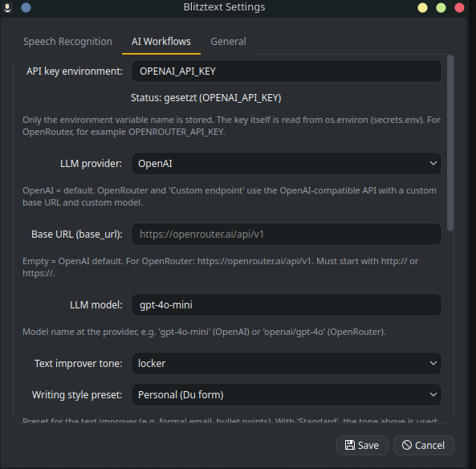
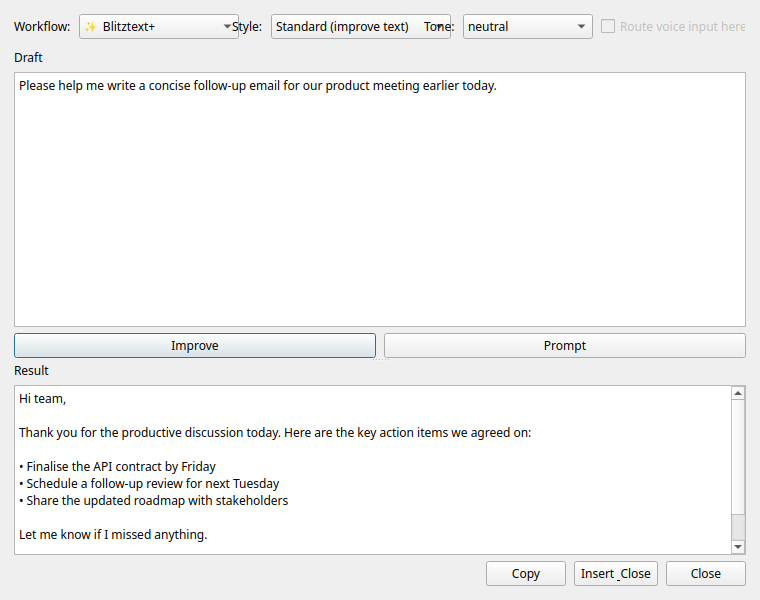
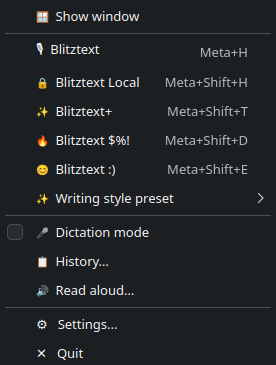
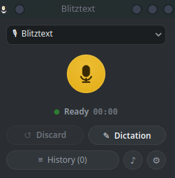
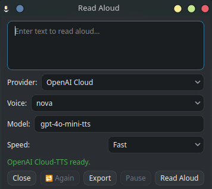
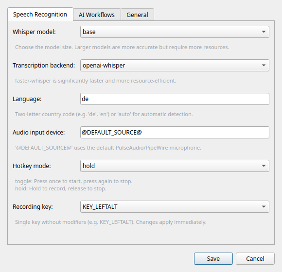
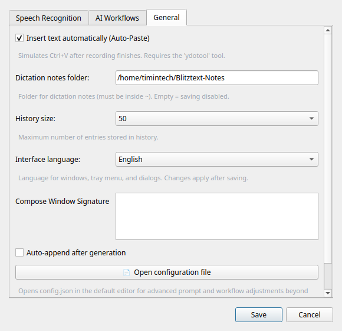

<div align="center">
  

  <h1>Blitztext Linux</h1>
  <p><strong>Your local AI voice assistant for KDE Plasma & Wayland</strong></p>

  <p>
    <a href="https://github.com/TimInTech/blitztext-linux/actions/workflows/blitztext-linux-ci.yml"></a>
    <a href="LICENSE"></a>
    
  </p>
  <p><strong>🇬🇧 English</strong> | <a href="README.de.md">🇩🇪 Deutsch</a></p>
  <p><i>Record speech via hotkey, transcribe locally or online, optionally rewrite it with an LLM, and paste it directly into the active application.</i></p>
</div>

> [!IMPORTANT]
> **Standalone Linux port:** This repository contains exclusively the Linux port of Blitztext – a standalone Python 3/PyQt6 implementation optimized for **Kubuntu/Ubuntu running KDE Plasma with Wayland**. For the original macOS version, please visit the [official main repository](https://github.com/cmagnussen/blitztext-app).

---

## Features

- **Multilingual interface (EN/DE):** Switch the app interface between German and English under **Settings → General → "Interface language"** (takes effect after restarting the app).
- **Compose window:** Type or paste any text, select a workflow and writing style, and let the AI rewrite it — no microphone needed. Includes tone selector, custom preset, variant history, and signature support.
- **OpenRouter & custom LLM endpoints:** Use OpenRouter or any OpenAI-compatible API as an alternative to OpenAI for all AI workflows.
- **Audio export:** Save read-aloud output as an audio file directly from the Read Aloud window.
- **Custom names / terms:** Extend the AI's vocabulary with your own terms, names, or technical words for perfect transcriptions.
- **Global hotkeys:** Record from anywhere in the system at any time.
- **Auto-paste:** Detects speech and pastes it right where your cursor is.
- **LLM-powered workflows:** Let the AI rephrase your sentences professionally, filter them emotionally, or enrich them with fitting emojis.
- **Local processing:** Optionally 100% offline for full privacy.

---

## Installation

### Quick install (recommended)

The easiest way to set up Blitztext on your system:

```bash
git clone https://github.com/TimInTech/blitztext-linux.git
cd blitztext-linux
bash scripts/install.sh
```

**What does the script do?**
It is idempotent (safe to run repeatedly) and handles everything fully automatically:
1. Checks your system (Ubuntu/Debian) & Python version.
2. Installs missing system packages (incl. `pipx`).
3. Prompts for the operating mode: global hotkeys with `input` group, or window/tray only without global hotkeys.
4. Sets up a `.venv` environment and installs `openai-whisper`/`faster-whisper`.
5. Prepares `ydotool.service` and the systemd user service.

### After installation

1. **Restart required only if you chose hotkey mode** (or log out/in) so the `input` group becomes active. Then verify:
   ```bash
   bash scripts/verify.sh
   ```
2. **Test manually:**
   ```bash
   ./run.sh
   ```
   *(Does the tray icon appear and do the hotkeys respond? Then everything went smoothly!)*
3. **Enable autostart:**
   ```bash
   systemctl --user start blitztext-linux
   ```

<details>
<summary><b>Disable autostart again</b></summary>

```bash
systemctl --user stop blitztext-linux
systemctl --user disable blitztext-linux
```
</details>

<details>
<summary><b>Manual installation (diagnostics / experts)</b></summary>

In case you want to debug specifically instead of using `scripts/install.sh`:

**1. System packages (apt)**
```bash
sudo apt install pulseaudio-utils wl-clipboard xclip ydotool ffmpeg python3-venv python3-evdev build-essential python3-dev socat pipx
```

| Package | Purpose |
| :--- | :--- |
| `pulseaudio-utils` | `parec` for audio recording via PulseAudio/PipeWire |
| `wl-clipboard` / `xclip` | Clipboard under Wayland (`wl-copy`) or X11 fallback |
| `ydotool` (≥ 1.0) | Simulates `Ctrl+V` for automatic pasting (auto-paste). From version 1.0 onward, raw keycodes are used. **Ubuntu 25.10/26.04** ship ydotool ≥ 1.0 (1.0.4) directly via `apt`. **Ubuntu 24.04 and 22.04** only ship 0.1.x via `apt` (e.g. 0.1.8), which does not support keycodes and therefore has no auto-paste – build ydotool ≥ 1.0 from source there (see below). Auto-paste verified on 24.04, 25.10, and 26.04. |
| `ffmpeg` | Audio conversions |
| `python3-evdev` | Input device access for the system-wide hotkey daemon |
| `socat` | Optional socket communication |
| `pipx` | Isolated installation of Whisper engines |

**2. Grant evdev permissions**
```bash
sudo usermod -aG input $USER
```

**3. Virtual environment & Python packages**
Install the CPU-only PyTorch wheel first inside the venv to avoid accidentally downloading large CUDA wheels:
```bash
python3 -m venv .venv
source .venv/bin/activate
pip install --index-url https://download.pytorch.org/whl/cpu torch
pip install PyQt6 evdev openai pytest openai-whisper faster-whisper
```

**4. Whisper engine as an alternative via pipx**
If you want to install `openai-whisper` decoupled from the venv (avoids version conflicts on newer Ubuntu setups due to Python 3.11):
```bash
pipx install --python "$(command -v python3.11)" openai-whisper
pipx inject openai-whisper faster-whisper   # optional, for accelerated execution
```

**5. Check ydotool**
```bash
systemctl --user start ydotool.service
```
If `apt` only provides ydotool 0.1.x (Ubuntu 24.04/22.04), build ydotool ≥ 1.0 from source:
```bash
sudo apt install cmake build-essential scdoc git
git clone --depth 1 --branch v1.0.4 https://github.com/ReimuNotMoe/ydotool.git
cd ydotool && cmake -B build -DCMAKE_BUILD_TYPE=Release && make -C build && sudo make -C build install
systemctl --user enable --now ydotool.service   # uses /usr/local/bin/ydotoold
```

**6. Start the application**
```bash
./run.sh
```
</details>

---

## The 5 workflows and hotkeys

Blitztext registers global hotkeys via `evdev`. With these combinations you have full control:

| Workflow | Hotkey | LLM? | Description |
| :--- | :--- | :---: | :--- |
| **Blitztext** | <kbd>Meta</kbd> + <kbd>H</kbd> | ❌ | Default: records, transcribes, and pastes the text. |
| **Blitztext Local** | <kbd>Meta</kbd> + <kbd>Shift</kbd> + <kbd>H</kbd> | ❌ | Forces a pure **offline transcription**. |
| **Blitztext+** | <kbd>Meta</kbd> + <kbd>Shift</kbd> + <kbd>T</kbd> | ✅ | Rephrases your recording professionally via LLM. |
| **Blitztext $%&!** | <kbd>Meta</kbd> + <kbd>Shift</kbd> + <kbd>D</kbd> | ✅ | Emotional release: turns frustration into a matter-of-fact message. |
| **Blitztext :)** | <kbd>Meta</kbd> + <kbd>Shift</kbd> + <kbd>E</kbd> | ✅ | Enriches your message with fitting emojis. |

> [!NOTE]
> **LLM workflows** (`Blitztext+`, `Blitztext $%&!`, `Blitztext :)`) require a valid **API key**. The easiest way is to place it in `~/.config/blitztext-linux/secrets.env` using the format `NAME=VALUE` (e.g. `OPENAI_API_KEY` set to your key). `./run.sh` and the systemd service load this file automatically. Without a key, these functions are disabled in the menu and via hotkeys, or result in an error message.

---

## AI workflows

The AI workflows help with phrasing, tone, and emojis. You'll find the relevant settings under **Settings → AI Workflows**:

<div align="center">
  
  <br><br>
</div>

### LLM providers

Blitztext supports three provider modes, selectable under **Settings → AI Workflows → "LLM provider"**:

| Provider | When to use |
| :--- | :--- |
| **OpenAI** (default) | Standard OpenAI API with `gpt-4o-mini` or any other model. |
| **OpenRouter** | Access hundreds of models via a single API key (`OPENROUTER_API_KEY`). Base URL: `https://openrouter.ai/api/v1`. |
| **Custom endpoint** | Any OpenAI-compatible API — set "Base URL" and "LLM model" to match your provider. |

For OpenRouter, set `base_url` to `https://openrouter.ai/api/v1` and choose your model (e.g. `openai/gpt-4o`). The API key environment variable name is configured under "API key environment".

### Writing-style presets

For the **Blitztext+** workflow (text improver) there are ready-made writing-style presets that you select under **Settings → AI Workflows → "Writing-style preset"** or directly in the **Compose window**:

| Preset | Effect |
| --- | --- |
| **Standard (improve text)** | Previous behavior – cleanly formatted text, the selected **tone** applies. |
| **Email – formal** | Polite email in the formal form with a clear structure. |
| **Email – casual** | Friendly email in the informal form. |
| **Bullet points** | Structures the content into concise bullet points. |
| **Summary** | Concise, factual summary of the key statements. |
| **Personal (informal)** | Clear text in a personal, informal tone. |
| **Polite (formal)** | Clear text in a polite, formal tone. |
| **Short & precise** | As concise as possible, without filler words and repetitions. |
| **Custom preset…** | A free-form system prompt you define yourself under **Settings → General → "Custom preset (Compose)"**. |

> With **Standard**, the configured **tone** (casual / neutral / professional) is additionally applied. Every other preset brings its own writing style and overrides the tone setting. Custom names/terms are preserved in all presets.

---

## Compose window

The **Compose window** (`✍ Compose…` in the tray menu) lets you rewrite any text using the AI — without recording your voice. It is ideal for editing existing drafts, emails, or notes.

<div align="center">
  <br>
  
  <br><br>
</div>

**How to open:** Click the tray icon → **✍ Compose…**

**What you can do in the Compose window:**

| Element | Description |
| :--- | :--- |
| **Draft (left pane)** | Type or paste the text you want to rewrite. |
| **Workflow** | Choose between Blitztext+ (text improver), Blitztext $%&! (steam release), or Blitztext :) (emojis). |
| **Writing-style preset** | Select a preset or **Custom preset…** for a fully custom system prompt. |
| **Tone** | Choose casual, neutral, or professional. Active only when **Standard** preset + **Blitztext+** is selected; grayed out for all other presets (a tooltip explains why). |
| **Improve** | Sends your draft to the AI and shows the result in the right pane. |
| **Variant history** | The last 10 generated results within the current session are kept as a scrollable list — click any entry to restore it. |
| **Signature** | Appends your saved signature (configured under **Settings → General**). Automatically replaces common AI-generated placeholders such as `[Your Name]`, `[Ihr Name]`, `[Vorname Nachname]`, `[Signature]`, and similar — so no stray placeholder is ever left behind. |
| **Copy** | Copies the result to the clipboard. |
| **Insert & Close** | Pastes the result directly into the active application and closes the window. |

> [!NOTE]
> The signature and custom preset text are configured under **Settings → General**. Set "Signature for Compose window" and toggle "Automatically append after generation" if you want the signature added to every result.

---

## Tray icon and context menu

The microphone in the system tray is your indicator of the current state:

<div align="center">
  <table>
    <tr>
      <td align="center" width="25%">
        <br><br>
        <b>Green</b> (IDLE)<br>
        <i>Ready — waiting for your action.</i>
      </td>
      <td align="center" width="25%">
        <br><br>
        <b>Red</b> (RECORDING)<br>
        <i>Recording is actively running.</i>
      </td>
      <td align="center" width="25%">
        <br><br>
        <b>Orange</b> (TRANSCRIBING)<br>
        <i>Magic in progress (transcription / AI rephrasing).</i>
      </td>
      <td align="center" width="25%">
        <br><br>
        <b>Gray</b> (ERROR)<br>
        <i>Oops, something went wrong.</i>
      </td>
    </tr>
  </table>
</div>

The tray context menu gives you quick access to all workflows, the compose window, writing-style presets, dictation mode, history, and settings:

<div align="center">
  <br>
  
  <br><br>
</div>

> [!NOTE]
> If no tray area is available in the desktop environment, the icon falls back to the system theme `audio-input-microphone`; the color coding may then not apply.

---

## Main window

The main window is your graphical control center — useful when hotkeys are blocked or you prefer mouse control:

<div align="center">
  <br>
  
  <br><br>
</div>

- **Workflow dropdown:** Select from all 5 recording modes.
- **Writing-style preset:** Visible when **Blitztext+** is selected — pick your preset directly in the main window. Changes sync to the tray instantly.
- **Start/Stop button:** Click to begin or end a recording.
- **Discard:** Cancels the current recording without transcription.
- **Dictation / History:** Quick access to dictation mode and the transcript history.
- **Read aloud / Settings:** Open the read-aloud window or the settings dialog.

*The window opens at startup and via the tray entry **Show window** or a click on the tray icon. Closing only hides the window — the app keeps running in the tray.*

---

## Dictation, history, and read-aloud

In addition to the workflows, the tool offers three convenience functions:

<div align="center">
  <br>
  
  
  <br><br>
</div>


| Menu item | Description |
| :--- | :--- |
| **Dictation mode** | Toggle. When active, all transcripts are collected as dictation entries and each saved as a Markdown file. The history then shows a **Merge** button that combines all entries and copies them to the clipboard. |
| **History…** | Opens a window with the most recent transcripts. Per entry: copy to clipboard or delete. |
| **Read aloud…** | Reads any text aloud to you — locally via **Piper TTS** (default) or optionally via **OpenAI Cloud TTS** (including provider, voice, and model selection). Use the **Export** button to save the audio as a file. |

> [!NOTE]
> **Dictation notes** are written exclusively into a folder **inside the home directory** (protection against path traversal), with permissions `0o600`.

> [!IMPORTANT]
> **Piper TTS** must be installed for the read-aloud function (as well as voices):
> ```bash
> .venv/bin/pip install piper-tts
> # Place voices (.onnx + .onnx.json) into ~/.local/share/piper-voices/
> ```
> If Piper or a voice is missing, the read-aloud window shows an installation hint; all other functions remain usable. Optional desktop notifications use `notify-send` (package `libnotify-bin`).

> [!NOTE]
> **OpenAI Cloud TTS** is an optional alternative to Piper. Requirements: the `openai` package (`.venv/bin/pip install openai`) and a valid key in the environment variable `OPENAI_API_KEY` (see `secrets.env` below). When first switching to the "OpenAI Cloud" provider, the read-aloud window asks for confirmation once, because the entered text is sent to OpenAI's servers for synthesis. Piper remains the default and works entirely locally.

---

## Configuration

Everything is stored locally and securely under `~/.config/blitztext-linux/config.json`. The OpenAI key is not stored in this file but read from an environment variable. The configuration file can be opened directly from the settings: **Settings → General → "Open configuration file"**.

The settings dialog has three tabs:

<div align="center">
  
  <br><i>Speech Recognition — Whisper model, backend, language, hotkey mode, and recording key.</i><br><br>
  
  <br><i>AI Workflows — LLM provider, API key, base URL, model, tone, and writing-style preset.</i><br><br>
  
  <br><i>General — Auto-Paste, dictation folder, history size, interface language, and signature.</i><br><br>
</div>


> [!IMPORTANT]
> The configuration file is automatically saved with restrictive file permissions (**`0o600` / `chmod 600`**). The real OpenAI key instead lives in `~/.config/blitztext-linux/secrets.env` or is provided as an environment variable.

<details>
<summary><b>Example configuration & field explanation</b></summary>

```json
{
  "model": "base",
  "language": "de",
  "ui_language": "en",
  "backend": "openai-whisper",
  "hotkey_mode": "hold",
  "transcription_hotkey": "KEY_LEFTALT",
  "openai_api_key_env": "OPENAI_API_KEY",
  "autopaste": true,
  "paste_key_delay_ms": 80,
  "audio_device": "@DEFAULT_SOURCE@",
  "notes_folder": "~/Blitztext-Notizen",
  "history_size": 50,
  "llm_provider": "openai",
  "llm_base_url": "",
  "llm_model": "gpt-4o-mini",
  "tts_provider": "piper",
  "tts_voice": "",
  "tts_openai_model": "gpt-4o-mini-tts",
  "tts_openai_voice": "marin",
  "tts_speed": 1.0,
  "compose_signature_text": "",
  "compose_signature_auto_append": false,
  "compose_custom_preset_text": "",
  "workflows": {
    "text_improver_tone": "neutral",
    "writing_preset": "standard",
    "emoji_density": "medium",
    "dampf_system_prompt": ""
  }
}
```

- **model**: Whisper model size (`tiny`, `base`, `small`, `medium`, `large`, `large-v2`, `large-v3`, `large-v3-turbo`). Default: `base`.
- **language**: Transcription language (`de`, `en`) or `auto`.
- **ui_language**: Language of the app interface (`de` or `en`). Default: `de`. Changes take effect after a restart.
- **backend**: `openai-whisper` or `faster-whisper`.
- **hotkey_mode**: 
  - `toggle`: press once to start, press again to stop.
  - `hold`: recording runs as long as the hotkey is held.
- **transcription_hotkey**: Recording key captured by the global hotkey daemon. Default: `KEY_LEFTALT`.
- **openai_api_key_env**: Name of the environment variable for the API key. Default: `OPENAI_API_KEY`. For OpenRouter use `OPENROUTER_API_KEY`.
- **llm_provider**: `openai` (default), `openrouter`, or `custom`.
- **llm_base_url**: Custom API base URL. Empty = OpenAI default. For OpenRouter: `https://openrouter.ai/api/v1`.
- **llm_model**: Model name at the provider, e.g. `gpt-4o-mini` (OpenAI) or `openai/gpt-4o` (OpenRouter).
- **autopaste**: Pastes via `ydotool`.
- **paste_key_delay_ms**: Delay in milliseconds between synthetic key events for auto-paste. Default: `80`.
- **audio_device**: Name of the audio source.
- **notes_folder**: Folder for dictation notes; it must stay inside your home directory. Default: `~/Blitztext-Notizen`.
- **history_size**: Number of recent transcripts kept in the History window. Clamped to 10-100. Default: `50`.
- **compose_signature_text**: Signature text appended in the Compose window.
- **compose_signature_auto_append**: Auto-append signature after every generation in Compose (`true`/`false`).
- **compose_custom_preset_text**: Free-form system prompt for the "Custom preset…" option in the Compose window.
- **tts_provider**: TTS provider for "Read aloud" — `piper` (local, default) or `openai` (cloud).
- **tts_voice**: Voice name used by the active TTS provider. Default: `""` = Piper default voice.
- **tts_openai_model** / **tts_openai_voice**: Model and voice for OpenAI Cloud TTS (default: `gpt-4o-mini-tts`, `marin`).
- **tts_openai_consent**: `true` once the one-time privacy confirmation for Cloud TTS has been granted. Default: `false`.
- **tts_speed**: Speech speed multiplier for "Read aloud". Default: `1.0`.
- **workflows**: Fine-tuning of tonality (`text_improver_tone`), writing-style preset (`writing_preset`), emojis (`emoji_density`), and the steam-release prompt (`dampf_system_prompt`).
</details>

---

## Development and tests

We love stability! Run the tests locally:

```bash
pytest
```

With `WHISPER_GUI_TESTS=1 QT_QPA_PLATFORM=offscreen pytest`, the GUI tests (main window, compose window) run additionally.

<details>
<summary><b>Directory overview</b></summary>

```text
.
├── app/
│   ├── __init__.py
│   ├── audio_recorder.py   # PulseAudio/PipeWire recording via parec
│   ├── blitztext_linux.py  # PyQt6 main application (system tray)
│   ├── compose_window.py   # Compose window for text-only AI rewriting
│   ├── config.py           # Configuration manager
│   ├── history_panel.py    # Transcript history panel
│   ├── hotkey_service.py   # evdev-based hotkey daemon
│   ├── i18n.py             # Interface translations (DE/EN)
│   ├── llm_service.py      # OpenAI / OpenRouter / custom endpoint interface
│   ├── main_window.py      # Main application window
│   ├── paste_service.py    # Wayland clipboard integration
│   ├── transcribe.py       # Whisper transcription
│   ├── tts_window.py       # Read Aloud window with audio export
│   ├── workflows.py        # Workflow definitions
│   └── writing_presets.py  # Writing-style preset definitions
├── tests/                  # Test suite
└── README.md               # This document (German version: README.de.md)
```
</details>

---

## Important notes

- **Linux exclusive:** For Linux systems only.
- **Wayland focus:** Developed for Wayland (`wl-clipboard`, `ydotool`).
- **Privacy:** Local workflows stay 100% on your machine. OpenAI or OpenRouter is only contacted when needed for LLM or Cloud TTS tasks.
- **Security (`evdev` & `input` group):** The tool reads input globally via `/dev/input/event*`. At the system level, this means all of the user's processes could read along with input (a trade-off under Wayland without XDG GlobalShortcuts). Only use Blitztext in environments you trust!
- **Developer note:** This project was designed with the support of artificial intelligence (AI-assisted). Architecture, code, and tests were reviewed manually and verified locally for function/security.

---

## Legal / Imprint & privacy (original project)

This project is a Linux port of the macOS application "Blitztext". For fairness and correct attribution, we refer to the legal information of the original project:

The original project is an experimental, non-commercial open-source project under the MIT license. The associated website ([blitztext.de](https://blitztext.de/)) is operated by Blackboat Internet GmbH:

- Imprint: https://www.blackboat.com/impressum
- Privacy: https://www.blackboat.com/datenschutz

---

<div align="center">
  <sub>Made with ❤️ (and a little AI help).</sub>
</div>
