<div align="center">
  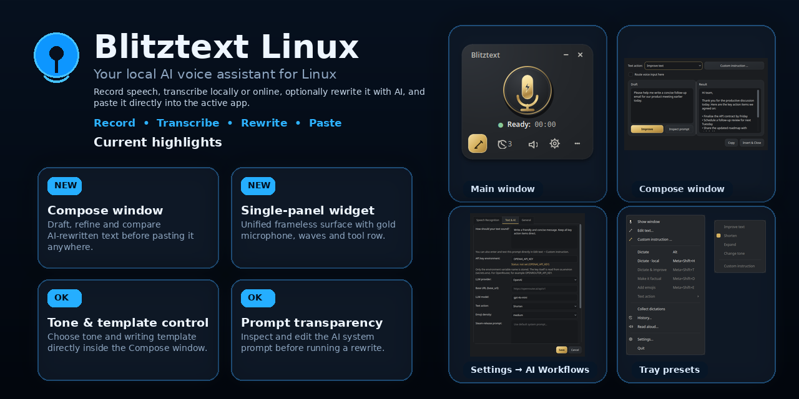

  <h1>Blitztext Linux</h1>
  <p><strong>Your local AI voice assistant for Linux desktops on Wayland</strong></p>

  <p>
    <a href="https://timintech.github.io/blitztextweb/"></a>
  </p>

  <p>
    <a href="https://github.com/TimInTech/blitztext-linux/actions/workflows/blitztext-linux-ci.yml"></a>
    <a href="LICENSE"></a>
    
  </p>
  <p><strong>🇬🇧 English</strong> | <a href="README.de.md">🇩🇪 Deutsch</a></p>
  <p><i>Record speech via hotkey, transcribe locally or online, optionally rewrite it with an LLM, and paste it directly into the active application.</i></p>
  <p><strong>🔗 Website: <a href="https://timintech.github.io/blitztextweb/">timintech.github.io/blitztextweb</a></strong></p>
</div>

<div align="center">
  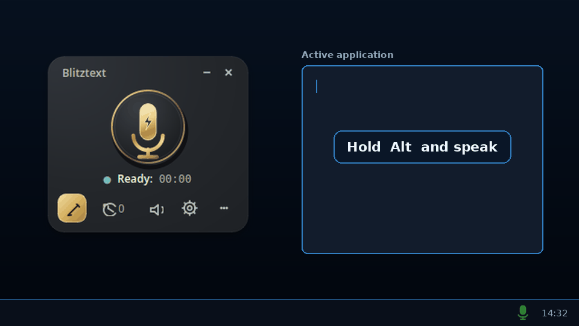
  <br>
  <sub>Hold <kbd>Alt</kbd> (default hotkey), speak, release — the transcript lands directly in the active application.</sub>
</div>

> [!IMPORTANT]
> **Standalone Linux port:** This repository contains exclusively the Linux port of Blitztext – a standalone Python 3/PyQt6 implementation developed on **KDE Plasma with Wayland** and also verified natively on **Ubuntu 26.04 GNOME with Wayland**. For the original macOS version, please visit the [official main repository](https://github.com/cmagnussen/blitztext-app).

---

## Purpose

Blitztext Linux is a hotkey-driven voice assistant that turns speech into text and pastes it directly into whatever application has focus. Transcription runs locally via Whisper by default; an LLM step is optional and only used when you explicitly pick one of the AI workflows (rephrase, tone filter, emoji enrichment) or the Compose window. Everything is designed to stay on your machine unless you deliberately opt into a cloud provider (OpenAI, OpenRouter, or a custom OpenAI-compatible endpoint) for LLM or Cloud TTS features.

---

## Features

- **Multilingual interface (EN/DE):** Switch the app interface between German and English under **Settings → General → "Interface language"** (takes effect after restarting the app).
- **Compose window:** Type, paste, or dictate any text, pick a text action, and let the AI rewrite it — no microphone needed. Includes tone selector, custom instruction with prompt inspection, variant navigation, and signature support.
- **OpenRouter & custom LLM endpoints:** Use OpenRouter or any OpenAI-compatible API as an alternative to OpenAI for all AI workflows.
- **Audio export:** Save read-aloud output as an audio file directly from the Read Aloud window.
- **Custom names / terms:** Extend the AI's vocabulary with your own terms, names, or technical words for perfect transcriptions.
- **Global hotkeys:** Record from anywhere in the system at any time.
- **Auto-paste:** Detects speech and pastes it right where your cursor is.
- **LLM-powered workflows:** Let the AI rephrase your sentences professionally, filter them emotionally, or enrich them with fitting emojis.
- **Local processing:** Optionally 100% offline for full privacy.

### The 5 workflows and hotkeys

Blitztext registers global hotkeys via `evdev`. With these combinations you have full control:

| Workflow | Hotkey | LLM? | Description |
| :--- | :--- | :---: | :--- |
| **Dictate** | <kbd>Alt</kbd> (hold) | ❌ | Default: records while the key is held, transcribes, and pastes the text. Very short presses below 150 ms are discarded as accidental taps in hold mode. Recording key and hold/toggle mode are configurable under **Settings → Speech Recognition**. |
| **Dictate · local** | <kbd>Meta</kbd> + <kbd>Shift</kbd> + <kbd>H</kbd> | ❌ | Forces a pure **offline transcription**. |
| **Dictate & improve** | <kbd>Meta</kbd> + <kbd>Shift</kbd> + <kbd>T</kbd> | ✅ | Transcribes and rewrites the result with the selected text action. |
| **Make it factual** | <kbd>Meta</kbd> + <kbd>Shift</kbd> + <kbd>D</kbd> | ✅ | Emotional release: turns frustration into a matter-of-fact message. |
| **Add emojis** | <kbd>Meta</kbd> + <kbd>Shift</kbd> + <kbd>E</kbd> | ✅ | Enriches your message with fitting emojis. |

> [!NOTE]
> **LLM workflows** (`Dictate & improve`, `Make it factual`, `Add emojis`) require a valid **API key**. See [Secrets](#secrets) below for how to configure it. Without a key, these functions are disabled in the menu and via hotkeys, or result in an error message.

### AI workflows

The AI workflows help with phrasing, tone, and emojis. You'll find the relevant settings under **Settings → Text & AI**:

<div align="center">
  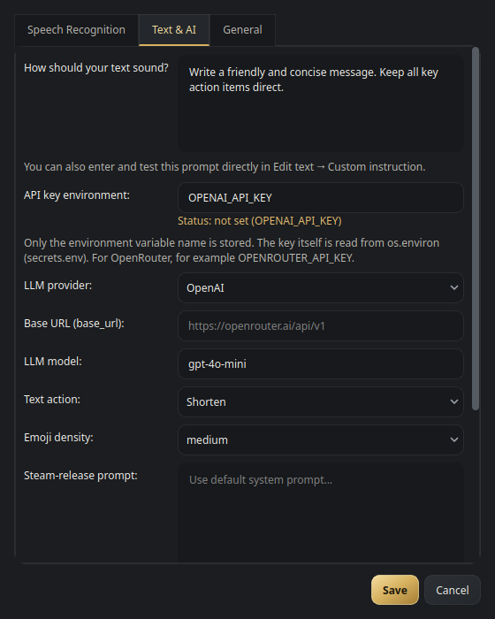
  <br><br>
</div>

> [!IMPORTANT]
> **“API key environment” is not an input field for the secret API key.** Enter
> only the environment-variable name there, such as `OPENAI_API_KEY` for OpenAI
> or `OPENROUTER_API_KEY` for OpenRouter. Saving the settings does not write the
> actual key to `config.json` or automatically create another file for it.
> Store the key separately in `~/.config/blitztext-linux/secrets.env`; `./run.sh`
> and the systemd user service load that file on the next start. See
> [Secrets](#secrets) for the complete file format and permission instructions.

**LLM providers.** Blitztext supports three provider modes, selectable under **Settings → Text & AI → "LLM provider"**:

| Provider | When to use |
| :--- | :--- |
| **OpenAI** (default) | Standard OpenAI API with `gpt-4o-mini` or any other model. |
| **OpenRouter** | Access hundreds of models via a single API key (`OPENROUTER_API_KEY`). Base URL: `https://openrouter.ai/api/v1`. |
| **Custom endpoint** | Any OpenAI-compatible API — set "Base URL" and "LLM model" to match your provider. |

For OpenRouter, set `base_url` to `https://openrouter.ai/api/v1` and choose your model (e.g. `openai/gpt-4o`). The API key environment variable name is configured under "API key environment".

**Text actions.** Rewriting is built around five clearly separated actions. You select them under **Settings → Text & AI → "Text action"**, in the Compose window, or in the ⋯ menu of the main widget:

| Text action | Effect |
| --- | --- |
| **Improve text** | Default: cleanly formatted text with corrected grammar and punctuation; the selected **target tone** applies. |
| **Shorten** | Removes filler words, repetitions, and detours while keeping every essential piece of information. |
| **Expand** | Turns notes and fragments into coherent prose — without adding new facts. |
| **Change tone** | Changes the tone only (casual / neutral / professional) and leaves content, language, and intent untouched. |
| **Custom instruction** | Your own instruction from the Compose window ("How should your text sound?"). **Save & use for dictation** also applies it to the Dictate & improve workflow. |

> The **target tone** applies to **Improve text** and **Change tone**. Older configurations with the previous nine writing-style presets are migrated automatically to the closest action (e.g. "Email – formal" → **Change tone**, professional). Custom names/terms are preserved in every action.

### Compose window

The **Compose window** (`✍ Edit text…` in the tray menu or the pen button in the main widget) lets you draft, rewrite, and refine text using the AI — without recording your voice. It is ideal for polishing emails, notes, or messages before pasting them anywhere.

<div align="center">
  <br>
  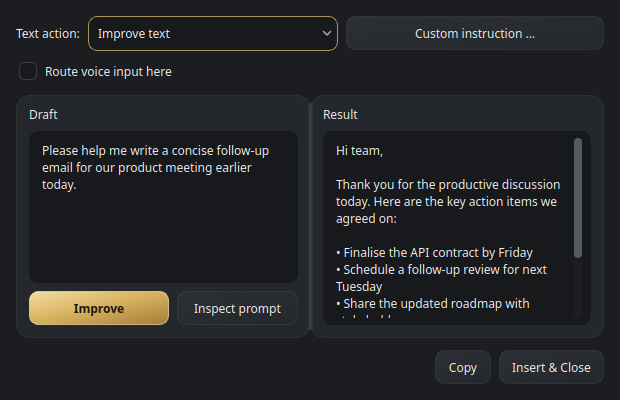
  <br><br>
</div>

**How to open:** Click the tray icon → **✍ Edit text…** or click the gold pen button in the main window widget.

**What you can do in the Compose window:**

| Element | Description |
| :--- | :--- |
| **Text action selector** | Choose between *Improve text*, *Shorten*, *Expand*, *Change tone*, or *Custom instruction*. |
| **Tone selector** | Appears dynamically when *Change tone* is selected (Casual, Neutral, Professional). |
| **Custom instruction …** | Expands an inline prompt editor (*"How should your text sound?"*). **Improve** uses this instruction for the current draft; **Save & use for dictation** persists it for future sessions and selects it for dictation workflows. |
| **Inspect prompt** | Inspect the exact system prompt and instructions before submitting to the LLM. |
| **Route voice input here** | When checked, active voice dictations are inserted directly into the draft field instead of being pasted to the active application. |
| **Draft (left pane)** | Type, paste, or dictate the text you want to rewrite. |
| **Result (right pane)** | Shows the AI-generated output side by side with your draft. |
| **Variant navigation** | The results generated in this session stay available — step through them with the ‹ › arrows above the result pane. |
| **Copy** | Copies the generated result to the clipboard. |
| **Insert & Close** | Pastes the result directly into the active application and closes the compose window. |

<div align="center">
  <br>
  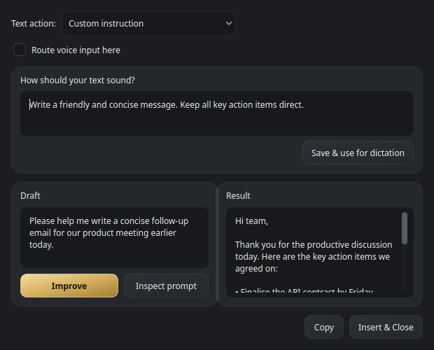
  <br>
  <sub>Inspect and edit the LLM instruction directly inside the Compose window.</sub>
  <br><br>
</div>

> [!NOTE]
> Signature and custom preset text are configured under **Settings → General**. Set "Compose Window Signature" and toggle "Auto-append after generation" if you want your signature automatically added to every result. Common AI placeholders (like `[Your Name]`) are cleanly replaced.

### Tray icon and context menu

The microphone in the system tray is your indicator of the current state:

<div align="center">
  <table>
    <tr>
      <td align="center" width="25%">
        <br><br>
        <b>Green</b> (IDLE)<br>
        <i>Ready — waiting for your action.</i>
      </td>
      <td align="center" width="25%">
        <br><br>
        <b>Red</b> (RECORDING)<br>
        <i>Recording is actively running.</i>
      </td>
      <td align="center" width="25%">
        <br><br>
        <b>Orange</b> (TRANSCRIBING)<br>
        <i>Magic in progress (transcription / AI rephrasing).</i>
      </td>
      <td align="center" width="25%">
        <br><br>
        <b>Gray</b> (ERROR)<br>
        <i>Oops, something went wrong.</i>
      </td>
    </tr>
  </table>
</div>

The tray context menu gives you quick access to all workflows, the compose window, text actions, dictation mode, history, and settings:

<div align="center">
  <br>
  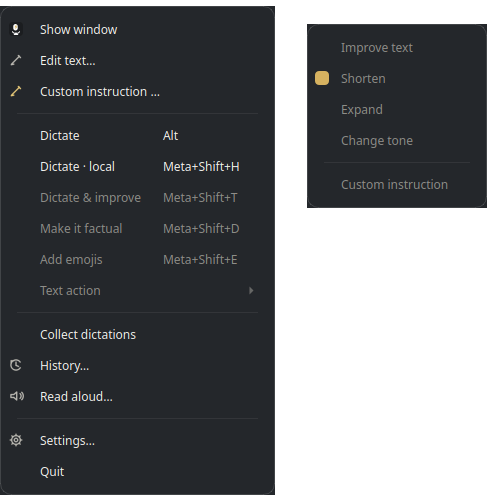
  <br><br>
</div>

> [!NOTE]
> If no tray area is available in the desktop environment, the icon falls back to the system theme `audio-input-microphone`; the color coding may then not apply.

### Main window: Single-panel widget

The main window is a compact, frameless desktop widget with a consistent dark look, gold accents, and immediate visual feedback:

<div align="center">
  <table>
    <tr>
      <td align="center" width="25%">
        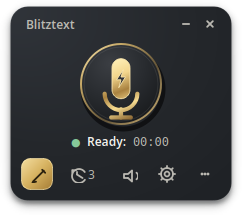<br><br>
        <b>Idle</b><br>
        <i>Ready, standing by for input.</i>
      </td>
      <td align="center" width="25%">
        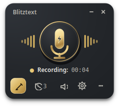<br><br>
        <b>Recording</b><br>
        <i>Live timer and stereo wave bars.</i>
      </td>
      <td align="center" width="25%">
        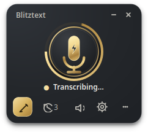<br><br>
        <b>Processing</b><br>
        <i>Animated gold spinning ring.</i>
      </td>
      <td align="center" width="25%">
        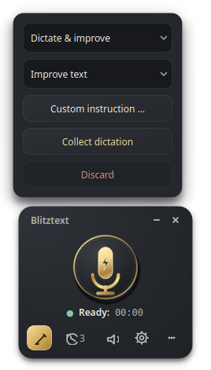<br><br>
        <b>Options menu</b><br>
        <i>Workflows and quick actions.</i>
      </td>
    </tr>
  </table>
</div>

- **Central gold microphone:** Prominent circular button with metallic gradient and lightning bolt cut-out. Click to toggle recording on and off.
- **Dynamic visual feedback:**
  - **Idle:** Green status dot with duration counter (`Ready: 00:00`).
  - **Recording:** Amber indicator, live recording timer, and animated stereo wave bars flanking the mic.
  - **Processing:** Rotating gold progress ring around the microphone (`Transcribing…`).
- **Tool row:**
  - ✍ **Compose button** (highlighted pen icon): Opens the Compose window for drafting and rewriting.
  - 🕒 **History button** (with counter badge): Opens the transcript history with recent entries.
  - 🔊 **Read aloud button** (speaker icon): Opens the TTS window to synthesize speech.
  - ⚙ **Settings button** (gear icon): Opens the settings dialog.
  - ⋯ **More options button**: Pops up quick access to *Dictate & improve*, text improvement presets (*Shorten*, *Expand*, *Change tone*), *Custom instruction*, *Batch dictation*, and *Discard*.

*The widget opens at startup, via the tray entry **Show window**, or by clicking the tray icon. Closing only hides the widget — the app keeps running in the background tray.*

### Dictation, history, and read-aloud

In addition to the workflows, the tool offers three convenience functions:

<div align="center">
  <br>
  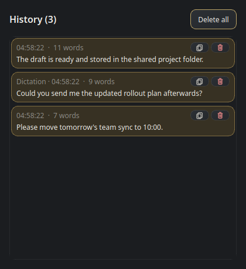
  &nbsp;&nbsp;
  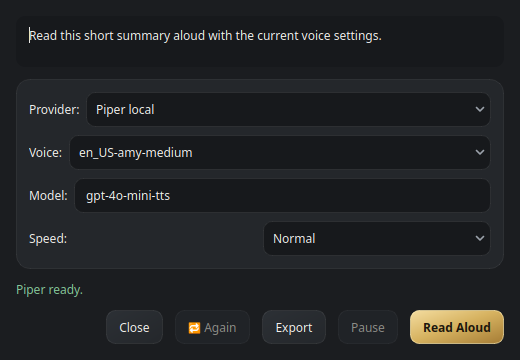
  <br><br>
</div>

| Menu item | Description |
| :--- | :--- |
| **Dictation mode** | Toggle. When active, all transcripts are collected as dictation entries and each saved as a Markdown file. The history then shows a **Merge** button that combines all entries and copies them to the clipboard. |
| **History…** | Opens a window with the most recent transcripts. Per entry: copy to clipboard or delete. |
| **Read aloud…** | Reads any text aloud to you — locally via **Piper TTS** (default) or optionally via **OpenAI Cloud TTS** (including provider, voice, and model selection). Use the **Export** button to save the audio as a file. |

> [!NOTE]
> **Dictation notes** are written exclusively into a folder **inside the home directory** (protection against path traversal), with permissions `0o600`.

> [!IMPORTANT]
> **Piper TTS** must be installed for the read-aloud function (as well as voices):
> ```bash
> .venv/bin/pip install piper-tts
> # Place voices (.onnx + .onnx.json) into ~/.local/share/piper-voices/
> ```
> If Piper or a voice is missing, the read-aloud window shows an installation hint; all other functions remain usable. Optional desktop notifications use `notify-send` (package `libnotify-bin`).

> [!NOTE]
> **OpenAI Cloud TTS** is an optional alternative to Piper. Requirements: the `openai` package (`.venv/bin/pip install openai`) and a valid key in the environment variable `OPENAI_API_KEY` (see [Secrets](#secrets) below). When first switching to the "OpenAI Cloud" provider, the read-aloud window asks for confirmation once, because the entered text is sent to OpenAI's servers for synthesis. Piper remains the default and works entirely locally.

---

## Installation & Start

### Quick install (recommended)

The easiest way to set up Blitztext on your system:

```bash
git clone https://github.com/TimInTech/blitztext-linux.git
cd blitztext-linux
bash scripts/install.sh
```

**What does the script do?**
It is idempotent (safe to run repeatedly) and handles everything fully automatically:
1. Checks your system (Ubuntu/Debian) & Python version.
2. Installs missing system packages (incl. `pipx`).
3. Prompts for the operating mode: global hotkeys with `input` group, or window/tray only without global hotkeys.
4. Sets up a `.venv` environment and installs `openai-whisper`/`faster-whisper`.
5. Prepares `ydotool.service`, installs the systemd user service, and enables it
   for autostart without starting it immediately.

### After installation

1. **Restart required only if you chose hotkey mode** (or log out/in) so the `input` group becomes active. Then verify:
   ```bash
   bash scripts/verify.sh
   ```
2. **Test manually:**
   ```bash
   ./run.sh
   ```
   *(Does the tray icon appear and do the hotkeys respond? Then everything went smoothly!)*
3. **Close the manual test app, then start the already enabled autostart service:**
   ```bash
   systemctl --user start blitztext-linux
   ```

> **Ubuntu 26.04 GNOME / Wayland status (verified 2026-08-10):** A clean
> installation on Python 3.14.4 passed `scripts/verify.sh` with 17 PASS, 0 FAIL,
> 0 WARN before the first user configuration and 18 PASS, 0 FAIL, 0 WARN
> afterwards. The main window, GNOME AppIndicator tray, audio recording, local
> `openai-whisper` transcription, the global Left-Alt hotkey, Wayland clipboard,
> `ydotool` auto-paste, and systemd user-service autostart were all exercised in
> the real desktop session. This verification applies to the native install,
> not the experimental Flatpak manifest.

<details>
<summary><b>Disable autostart again</b></summary>

```bash
systemctl --user stop blitztext-linux
systemctl --user disable blitztext-linux
```
</details>

<details>
<summary><b>Manual installation (diagnostics / experts)</b></summary>

In case you want to debug specifically instead of using `scripts/install.sh`:

**1. System packages (apt)**
```bash
sudo apt install pulseaudio-utils wl-clipboard xclip ydotool ffmpeg python3-venv python3-evdev build-essential python3-dev socat pipx
```

| Package | Purpose |
| :--- | :--- |
| `pulseaudio-utils` | `parec` for audio recording via PulseAudio/PipeWire |
| `wl-clipboard` / `xclip` | Clipboard under Wayland (`wl-copy`) or X11 fallback |
| `ydotool` | Simulates automatic pasting. Blitztext uses symbolic shortcuts, which work with Ubuntu 24.04's ydotool 0.1.8 and ydotool ≥ 1.0: `Ctrl+Shift+V` for terminal-compatible Wayland fallback, otherwise `Ctrl+V`. |
| `ffmpeg` | Audio conversions |
| `python3-evdev` | Input device access for the system-wide hotkey daemon |
| `socat` | Optional socket communication |
| `pipx` | Isolated installation of Whisper engines |

**2. Grant evdev permissions**
```bash
sudo usermod -aG input $USER
```

**3. Virtual environment & Python packages**
Install the CPU-only PyTorch wheel first inside the venv to avoid accidentally downloading large CUDA wheels:
```bash
python3 -m venv .venv
source .venv/bin/activate
pip install --index-url https://download.pytorch.org/whl/cpu torch
pip install PyQt6 evdev openai pytest openai-whisper faster-whisper
```

**4. Whisper engine as an alternative via pipx**
If you want to install `openai-whisper` decoupled from the venv, use the
available system interpreter. The verified Ubuntu 26.04 path uses the project
venv with Python 3.14.4, so pipx is not required there:
```bash
pipx install --python "$(command -v python3)" openai-whisper
pipx inject openai-whisper faster-whisper   # optional, for accelerated execution
```

**5. Check ydotool**
```bash
systemctl --user start ydotool.service
```
If `apt` only provides ydotool 0.1.x (Ubuntu 24.04/22.04), build ydotool ≥ 1.0 from source:
```bash
sudo apt install cmake build-essential scdoc git
git clone --depth 1 --branch v1.0.4 https://github.com/ReimuNotMoe/ydotool.git
cd ydotool && cmake -B build -DCMAKE_BUILD_TYPE=Release && make -C build && sudo make -C build install
systemctl --user enable --now ydotool.service   # uses /usr/local/bin/ydotoold
```

**6. Start the application**
```bash
./run.sh
```
</details>

---

## Configuration

Everything is stored locally under `~/.config/blitztext-linux/config.json`. This file holds no secrets — the OpenAI/OpenRouter key is read from an environment variable (see [Secrets](#secrets)). The configuration file can be opened directly from the settings: **Settings → General → "Open configuration file"**.

The settings dialog has three tabs:

<div align="center">
  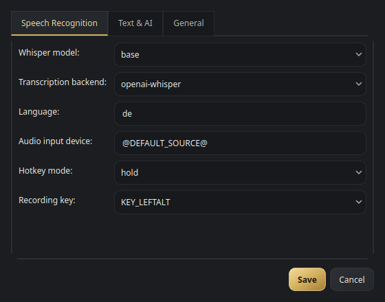
  <br><i>Speech Recognition — Whisper model, backend, language, hotkey mode, and recording key.</i><br><br>
  
  <br><i>Text &amp; AI — system prompt, API key environment, LLM provider, base URL, model, text action, and emoji density.</i><br><br>
  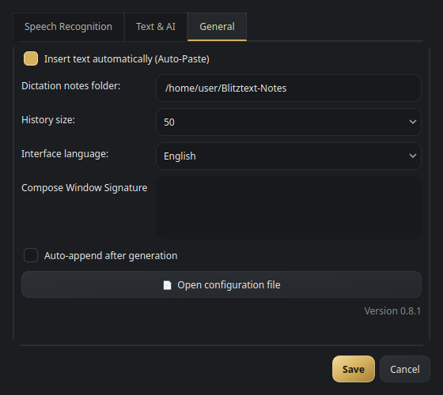
  <br><i>General — Auto-Paste, dictation folder, history size, interface language, and signature.</i><br><br>
</div>

> [!IMPORTANT]
> The configuration file is automatically saved with restrictive file permissions (**`0o600` / `chmod 600`**).

<details>
<summary><b>Example configuration & field explanation</b></summary>

```json
{
  "model": "base",
  "language": "de",
  "ui_language": "en",
  "backend": "openai-whisper",
  "hotkey_mode": "hold",
  "transcription_hotkey": "KEY_LEFTALT",
  "openai_api_key_env": "OPENAI_API_KEY",
  "autopaste": true,
  "paste_key_delay_ms": 80,
  "audio_device": "@DEFAULT_SOURCE@",
  "notes_folder": "~/Blitztext-Notizen",
  "history_size": 50,
  "llm_provider": "openai",
  "llm_base_url": "",
  "llm_model": "gpt-4o-mini",
  "tts_provider": "piper",
  "tts_voice": "",
  "tts_openai_model": "gpt-4o-mini-tts",
  "tts_openai_voice": "marin",
  "tts_speed": 1.0,
  "compose_signature_text": "",
  "compose_signature_auto_append": false,
  "compose_custom_preset_text": "",
  "workflows": {
    "text_improver_tone": "neutral",
    "writing_preset": "standard",
    "emoji_density": "medium",
    "dampf_system_prompt": ""
  }
}
```

- **model**: Whisper model size (`tiny`, `base`, `small`, `medium`, `large`, `large-v2`, `large-v3`, `large-v3-turbo`). Default: `base`.
- **language**: Transcription language (`de`, `en`) or `auto`.
- **ui_language**: Language of the app interface (`de` or `en`). Default: `de`. Changes take effect after a restart.
- **backend**: `openai-whisper` or `faster-whisper`.
- **hotkey_mode**:
  - `toggle`: press once to start, press again to stop.
  - `hold`: recording runs as long as the hotkey is held. Presses below 150 ms are discarded; empty recordings return to ready without a persistent error state.
- **transcription_hotkey**: Recording key captured by the global hotkey daemon. Default: `KEY_LEFTALT`.
- **openai_api_key_env**: Name of the environment variable for the API key. Default: `OPENAI_API_KEY`. For OpenRouter use `OPENROUTER_API_KEY`.
- **llm_provider**: `openai` (default), `openrouter`, or `custom`.
- **llm_base_url**: Custom API base URL. Empty = OpenAI default. For OpenRouter: `https://openrouter.ai/api/v1`.
- **llm_model**: Model name at the provider, e.g. `gpt-4o-mini` (OpenAI) or `openai/gpt-4o` (OpenRouter).
- **autopaste**: Pastes via `ydotool`.
- **paste_key_delay_ms**: Delay in milliseconds between synthetic key events for auto-paste. Default: `80`.
- **audio_device**: Name of the audio source.
- **notes_folder**: Folder for dictation notes; it must stay inside your home directory. Default: `~/Blitztext-Notizen`.
- **history_size**: Number of recent transcripts kept in the History window. Clamped to 10-100. Default: `50`.
- **compose_signature_text**: Signature text appended in the Compose window.
- **compose_signature_auto_append**: Auto-append signature after every generation in Compose (`true`/`false`).
- **compose_custom_preset_text**: Free-form system prompt for the "Custom preset…" option in the Compose window.
- **tts_provider**: TTS provider for "Read aloud" — `piper` (local, default) or `openai` (cloud).
- **tts_voice**: Voice name used by the active TTS provider. Default: `""` = Piper default voice.
- **tts_openai_model** / **tts_openai_voice**: Model and voice for OpenAI Cloud TTS (default: `gpt-4o-mini-tts`, `marin`).
- **tts_openai_consent**: `true` once the one-time privacy confirmation for Cloud TTS has been granted. Default: `false`.
- **tts_speed**: Speech speed multiplier for "Read aloud". Default: `1.0`.
- **workflows**: Fine-tuning of tonality (`text_improver_tone`), text action (`writing_preset`), emojis (`emoji_density`), and the steam-release prompt (`dampf_system_prompt`).
</details>

---

## Secrets

API keys are never stored in `config.json` — they are read from environment variables at runtime.

**Recommended: `secrets.env`.** Place your key(s) in `~/.config/blitztext-linux/secrets.env`, one `NAME=VALUE` pair per line — the variable name matches the provider selected under **Settings → Text & AI → "API key environment"** (e.g. the OpenAI variable for OpenAI, the OpenRouter variable for OpenRouter), and `VALUE` is the secret key you got from that provider:

```bash
<VARIABLE_NAME>=<your-secret-value>
```

`./run.sh` and the systemd user service load this file automatically. `config.json` only stores the *name* of the environment variable to read (`openai_api_key_env`), never the key itself.

- Which variable is used depends on **Settings → Text & AI → "API key environment"** and the selected LLM provider (`OPENAI_API_KEY` for OpenAI, `OPENROUTER_API_KEY` for OpenRouter, or a custom name for a custom endpoint).
- Without a valid key, the LLM workflows (`Dictate & improve`, `Make it factual`, `Add emojis`) and OpenAI Cloud TTS are disabled or fail with an error message; local transcription and Piper TTS keep working.
- Never commit `secrets.env`, API keys, or tokens to git. If a key is ever exposed (e.g. committed by accident or pasted into an issue), rotate it immediately with the provider.
- `config.json` is written with restrictive permissions (`0o600`); keep the same expectation for `secrets.env`.

---

## Tests

Run the test suite locally:

```bash
pytest
```

With `WHISPER_GUI_TESTS=1 QT_QPA_PLATFORM=offscreen pytest`, the GUI tests (main window, compose window) run additionally.

`bash scripts/verify.sh` runs session-aware diagnostics for X11, Wayland, and clipboard backends — useful after installation or when troubleshooting hotkeys/paste behavior. Its output is diagnostic guidance, not a support promise; see the compatibility notes it prints for your desktop session.

---

## Flatpak MVP status

`packaging/flatpak/` contains an **experimental** Flatpak manifest spike — it is not a release channel and not published on Flathub.

- A structural validation (`flatpak-builder --show-manifest` / `--show-deps`) and a full local build (including the `org.kde.Platform`/`org.kde.Sdk` 6.8 download) have both succeeded on a development machine.
- The KDE 6.8 runtime is marked EOL upstream; it still builds and runs for this MVP. A runtime bump to 6.10 is a possible follow-up spike, not something implemented here.
- Inside the Flatpak sandbox, several features are intentionally disabled or degraded: no global hotkeys (no evdev/input-device access), no `ydotool` auto-paste (clipboard copy still works via the Qt fallback), no local Whisper transcription (excluded from `requirements-flatpak.txt` due to its size — cloud transcription/LLM workflows still work with `--share=network`), and no desktop notifications (`notify-send` is not bundled).
- No signing, no AppStream metadata, no `.desktop` file, and no packaged release exist for this spike.

See [`packaging/flatpak/README.md`](packaging/flatpak/README.md) for the exact manifest scope, build commands, and known deviations from Flathub conventions.

---

## Known limitations

- **Linux exclusive:** For Linux systems only.
- **Wayland focus:** Developed for Wayland (`wl-clipboard`, `ydotool`).
- **Privacy:** Local workflows stay 100% on your machine. OpenAI or OpenRouter is only contacted when needed for LLM or Cloud TTS tasks.
- **Security (`evdev` & `input` group):** The tool reads input globally via `/dev/input/event*`. At the system level, this means all of the user's processes could read along with input (a trade-off under Wayland without XDG GlobalShortcuts). Only use Blitztext in environments you trust!
- **Flatpak sandbox:** See [Flatpak MVP status](#flatpak-mvp-status) above — global hotkeys, auto-paste, local Whisper, and desktop notifications are unavailable inside the sandbox.

---

## Development

This project was designed with the support of artificial intelligence (AI-assisted). Architecture, code, and tests were reviewed manually and verified locally for function/security. See [CONTRIBUTING.md](CONTRIBUTING.md) for how to propose changes.

<details>
<summary><b>Directory overview</b></summary>

```text
.
├── app/
│   ├── __init__.py
│   ├── audio_recorder.py   # PulseAudio/PipeWire recording via parec
│   ├── blitztext_linux.py  # PyQt6 main application (system tray)
│   ├── compose_window.py   # Compose window for text-only AI rewriting
│   ├── config.py           # Configuration manager
│   ├── history_panel.py    # Transcript history panel
│   ├── hotkey_service.py   # evdev-based hotkey daemon
│   ├── i18n.py             # Interface translations (DE/EN)
│   ├── llm_service.py      # OpenAI / OpenRouter / custom endpoint interface
│   ├── main_window.py      # Main application window
│   ├── paste_service.py    # Wayland clipboard integration
│   ├── transcribe.py       # Whisper transcription
│   ├── tts_window.py       # Read Aloud window with audio export
│   ├── workflows.py        # Workflow definitions
│   └── writing_presets.py  # Text action definitions and legacy preset migration
├── packaging/flatpak/      # Experimental Flatpak MVP spike (see above)
├── tests/                  # Test suite
└── README.md               # This document (German version: README.de.md)
```
</details>

---

## Legal / Imprint & privacy (original project)

This project is a Linux port of the macOS application "Blitztext". For fairness and correct attribution, we refer to the legal information of the original project:

The original project is an experimental, non-commercial open-source project under the MIT license. The associated website ([blitztext.de](https://blitztext.de/)) is operated by Blackboat Internet GmbH:

- Imprint: https://www.blackboat.com/impressum
- Privacy: https://www.blackboat.com/datenschutz

---

<div align="center">
  <sub>Made with ❤️ (and a little AI help).</sub>
</div>

### Latest release notes (v0.8.1): Intent-preserving prompts and diagnostics

Blitztext+ and the writing presets now preserve the user's intent more conservatively. They avoid inventing meetings, participants, recipients, roles, or goals when rewriting spoken work instructions or handover prompts. Email presets only use email-like structure when the input is clearly meant as a message to someone.

The Linux verification script also includes improved session-aware desktop diagnostics for X11, Wayland, and clipboard backends. The compatibility matrix is diagnostic guidance, not a support promise.
